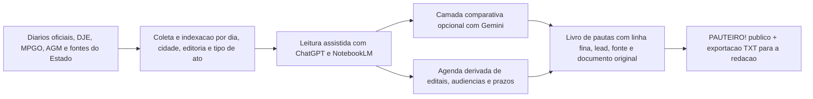

# PAUTEIRO!

Livro de pautas em HTML, CSS e JavaScript para leitura de diarios oficiais de Goias, com expansao historica preparada para 2024, 2025 e 2026.

## Entrada principal

- `pauteiro.html`: frente publica principal.
- `pauteiro-arquivo.js`: bucket anual do arquivo, com manifestos de 2024, 2025 e 2026.
- `pauteiro-2026-pautas.txt`: saida leve com linha fina e lead das pautas.
- `pauteiro-cobertura.js`: catalogo de cobertura com os 246 municipios de Goias, rota de diario e contagem carregada por ano.
- `radar-diarios-goias.html`: alias legado que redireciona para `pauteiro.html`.
- `radar-diarios-goias-cronologia.html`: alias legado da cronologia.
- `radar-diarios-goias-dia.html`: alias legado da pagina diaria parametrica.
- `radar-diarios-goias-data.js`: base principal consumida pela interface.
- `radar-diarios-goias-data.json`: espelho estruturado da base.
- `build-pauteiro-cobertura.ps1`: script para regenerar a camada de cobertura municipal a partir do IBGE e da base atual.
- `build-pauteiro-arquivo.ps1`: script para regenerar o bucket anual do arquivo.
- `radar-diarios-goias.css`: estilos da interface.
- `radar-diarios-goias-app.js`: montagem dinamica das paginas, integracao de IA e UI.
- `env.example.js`: template de configuracao opcional de chaves de API.

## Como abrir

- Local: abra `pauteiro.html` no navegador.
- Remoto: [https://raphaelbezerrajor.github.io/radar-diarios-goias/](https://raphaelbezerrajor.github.io/radar-diarios-goias/)

## Fluxo

## Escopo atual

## Novidades da Última Atualização

O PAUTEIRO! foi atualizado para uma arquitetura 100% *client-side* (serverless) e agora suporta as seguintes ferramentas embarcadas:

### Integração Nativa de IA (Gemini & ChatGPT)
- **Modal de APIs Global**: Clique no botão "⚙️ APIs IA" no rodapé para adicionar suas próprias chaves de API (Google AI Studio ou OpenAI). As chaves ficam salvas de forma segura apenas no *localStorage* do seu navegador. Nenhuma chave é enviada para servidores de terceiros (além da própria provedora).
- **Análise Inline**: Geração de resumos, leads e dicas de investigação direto na interface usando o modelo `gemini-2.5-flash-lite` (padrão) ou `gpt-4o-mini`.

### Gerenciamento de Coberturas (Fontes)
- **Painel de Coberturas**: Adicionado o botão "🔗 Coberturas" que abre um modal dinâmico. Permite editar os links oficiais (ex: DOMP, Sileg, DOE) ou adicionar novos alvos de raspagem (ex: Tribunal de Contas, novos Municípios). As alterações também ficam salvas localmente, e há uma função para exportar a configuração JSON para adicionar ao repositório oficial.
- 2026 segue como caderno corrente;
- 2024 e 2025 ja entram como arquivo historico pronto para carga;
- abril de 2026 esta preenchido ate 18/04/2026;
- buckets anuais separados para 2024, 2025 e 2026;
- catalogo municipal com os 246 municipios goianos e separacao entre diario proprio confirmado e rota AGM;
- busca por municipio, ano, editoria, tipo de diario e assunto;
- historico de busca salvo localmente no navegador da redacao;
- fila operacional de ingestao em: Goiania, Estado, MPGO e Municipios; TJGO fica pausado nesta rodada;
- calendario por dia;
- cronologia;
- pagina diaria;
- bloco de fluxo do sistema;
- exportacao leve em TXT;
- meta declarada de cobertura para os 246 municipios goianos, alem de MPGO, TJGO, Estado e diarios proprios.

## Observacao

O projeto esta em evolucao editorial. A proxima camada inclui ingestao historica de 2024 e 2025, ampliacao do volume de pautas em MPGO e TJGO, e cobertura municipal total dentro da mesma interface de busca.
