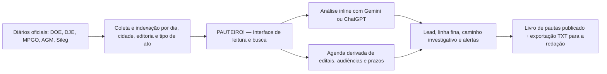

# PAUTEIRO! — Livro de Pautas de Diários Oficiais de Goiás

> Leitura inteligente de atos públicos, contratos, licitações e decretos — com assistência de IA direto no navegador, sem servidor.

---

## O que é o PAUTEIRO!?

O PAUTEIRO! é um **livro de pautas jornalístico** construído inteiramente em HTML, CSS e JavaScript puro — sem backend, sem banco de dados, sem servidor. Tudo roda no próprio navegador do repórter.

Ele foi criado para agilizar o trabalho de leitura e análise de **Diários Oficiais do Estado de Goiás**, incluindo:

- Diário Oficial do Estado (DOE)
- Diário Oficial do Município de Goiânia (Sileg)
- Diário Oficial do Ministério Público (DOMP/MPGO)
- Diário da Justiça Eletrônico (DJE/TJGO)
- Diários Municipais via AGM (246 municípios goianos)

A interface permite pesquisar, filtrar, visualizar e — agora — **analisar atos com IA** sem sair da tela.

---

## Funcionalidades

### 🔍 Busca e Filtros
- Pesquisa por município, ano, editoria e tipo de ato
- Histórico de buscas salvo localmente no navegador
- Filtros por fonte, escopo (municipal, estadual, MPGO etc.) e destaque editorial

### 📅 Organização Temporal
- **Calendário por dia**: visualize os atos publicados em datas específicas
- **Cronologia**: linha do tempo editorial dos atos mais relevantes por fonte
- **Página Diária parametrizada**: acesse qualquer dia diretamente pela URL

### 📦 Arquivo Histórico
- Buckets anuais separados para **2024, 2025 e 2026**
- 2026 funciona como caderno corrente; 2024 e 2025 como arquivo já indexado
- Abril de 2026 preenchido até 18/04/2026

### 🗺️ Cobertura Municipal
- Catálogo com os **246 municípios de Goiás**
- Separação entre municípios com diário próprio confirmado e rota AGM
- Contagem de entradas carregadas por ano e por município

### 📤 Exportação
- Saída leve em `.txt` com linha fina e lead das pautas para uso na redação

---

## Novidades desta versão

Esta atualização introduz uma camada completa de **Inteligência Artificial embarcada** e um **gerenciador visual de fontes**, transformando o PAUTEIRO! numa ferramenta de produção editorial ativa.

---

### ⚙️ Integração Nativa de IA (Gemini + ChatGPT)

Não é mais necessário copiar texto e colar em outro site. A análise de IA agora acontece **dentro da própria interface**, ao lado do ato publicado.

**Como funciona:**
1. Clique no botão **"⚙️ APIs IA"** que aparece fixo no rodapé da tela.
2. Insira sua chave da API do **Google Gemini** (gratuita, via [Google AI Studio](https://aistudio.google.com/app/apikey)) e/ou da **OpenAI/ChatGPT** (paga por token, via [platform.openai.com](https://platform.openai.com/api-keys)).
3. Escolha o modelo Gemini preferido no menu de seleção (padrão: `gemini-2.5-flash-lite`).
4. Salve. A página recarrega e os botões de análise inline ficam disponíveis em cada pauta.

**O que a IA produz para cada ato:**
- **Lead jornalístico** com abertura direta para publicação
- **Linha fina** de contextualização
- **Caminho investigativo** — o que o ato abre de perspectiva editorial
- **Alertas** de dados sensíveis (valores, nomeações, CPFs, contratos)

> 🔒 **Segurança**: Nenhuma chave de API é enviada para servidores do PAUTEIRO!. Elas ficam armazenadas exclusivamente no `localStorage` do seu navegador. O arquivo `env.js` está protegido no `.gitignore` e nunca vai para o repositório.

**Modelos disponíveis (Gemini):**

| Modelo | Observação |
|--------|------------|
| `gemini-2.5-flash-lite` | Padrão. Rápido e gratuito. |
| `gemini-2.5-flash` | Mais preciso. Gratuito na maioria das contas. |
| `gemini-3-flash-preview` | Preview. Verifique acesso na sua conta. |
| `gemini-3.1-flash-lite` | Preview avançado. |
| `gemini-3.1-pro-preview` | Alta capacidade. |

---

### 🔗 Gerenciador de Coberturas (Fontes)

Novo painel que permite gerenciar os **alvos de raspagem** diretamente pelo navegador — sem editar código.

**Como funciona:**
1. Clique no botão **"🔗 Coberturas"** (logo acima do botão de APIs IA).
2. O modal exibe todas as fontes configuradas no sistema (DOE, MPGO, Sileg, AGM, TJGO etc.).
3. Edite os campos de cada fonte: nome, link oficial, foco de análise, tipos de material e próximo passo editorial.
4. Use o botão **"➕ Nova Fonte"** para adicionar um alvo novo (ex: Tribunal de Contas, TCM, novos municípios).
5. Clique em **"Salvar e Atualizar"** — as novas fontes passam a aparecer automaticamente na aba **Cronologia**.

**Exportação para o repositório:**
Se quiser tornar suas edições permanentes no projeto, use o botão **"📋 Copiar JSON"**. Ele copia a estrutura atualizada das fontes em formato JSON — pronta para substituir o bloco `source_library` no arquivo `pauteiro-arquivo.js`.

---

## Estrutura de arquivos

| Arquivo | Função |
|---------|--------|
| `pauteiro.html` | Entrada principal da interface |
| `radar-diarios-goias-app.js` | Motor da interface: renderização, IA, modais |
| `radar-diarios-goias-data.js` | Base de dados principal consumida pela UI |
| `radar-diarios-goias-data.json` | Espelho estruturado da base |
| `radar-diarios-goias.css` | Estilos da interface |
| `pauteiro-arquivo.js` | Bucket anual (2024, 2025, 2026) e `source_library` |
| `pauteiro-cobertura.js` | Catálogo dos 246 municípios goianos |
| `pauteiro-2026-pautas.txt` | Exportação leve de leads e linhas finas |
| `env.example.js` | Template de configuração de chaves de API |
| `env.js` | Arquivo local de chaves (protegido por `.gitignore`) |
| `build-pauteiro-cobertura.ps1` | Script para regenerar a camada municipal |
| `build-pauteiro-arquivo.ps1` | Script para regenerar o bucket anual |
| `radar-diarios-goias.html` | Alias legado (redireciona para `pauteiro.html`) |
| `radar-diarios-goias-cronologia.html` | Alias legado da cronologia |
| `radar-diarios-goias-dia.html` | Alias legado da página diária parametrizada |

---

## Como usar

### Localmente
1. Clone o repositório ou baixe os arquivos.
2. Abra `pauteiro.html` diretamente no navegador (sem servidor necessário).
3. Configure sua chave de API pelo botão "⚙️ APIs IA" no rodapé.

### Em produção (Vercel / GitHub Pages)
1. Conecte o repositório ao Vercel.
2. O deploy é instantâneo — não há build, é 100% estático.
3. Ao acessar o link publicado, configure sua chave de API pelo modal na primeira utilização.

> ⚠️ **Atenção**: Nunca suba o arquivo `env.js` com chaves reais para o repositório. Use apenas o `env.example.js` como referência.

---

## Fluxo do sistema

---

## Fontes monitoradas

| Fonte | Status | Escopo |
|-------|--------|--------|
| DOE — Diário Oficial do Estado | ✅ Ativo | Contratos, SES, SSP, portarias, notificações |
| Sileg — Diário Oficial de Goiânia | ✅ Ativo | Decretos, pessoal, contratos municipais |
| DOMP — Diário do MPGO | ✅ Ativo | Inquéritos, TACs, ACPs, recomendações |
| AGM — Municípios (246 municípios) | ✅ Ativo | Licitações, nomeações, leis municipais |
| DJE — Diário da Justiça (TJGO) | ⏸ Pausado | Decisões, liminares, atos do tribunal |

---

## Próximos passos

- Ampliar a ingestão histórica de 2024 e 2025 com maior volume de pautas em MPGO e TJGO
- Escalar a cobertura municipal para os 246 municípios goianos com rota própria de diário
- Integrar o Tribunal de Contas do Estado (TCE-GO) como nova fonte permanente
- Adicionar validação de acessibilidade e suporte a modo offline (PWA)

---

## Observação editorial

O projeto está em evolução permanente. A prioridade corrente é fechar o retroativo de 2025 nas fontes estaduais e municipais antes de ampliar para as demais instâncias.

---

*Desenvolvido para uso jornalístico. Dados extraídos de fontes públicas oficiais.*
